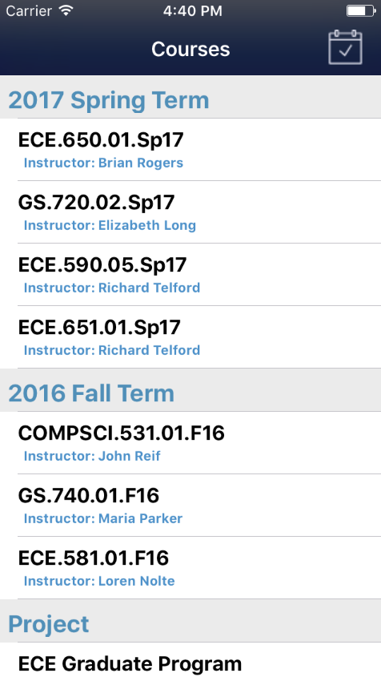
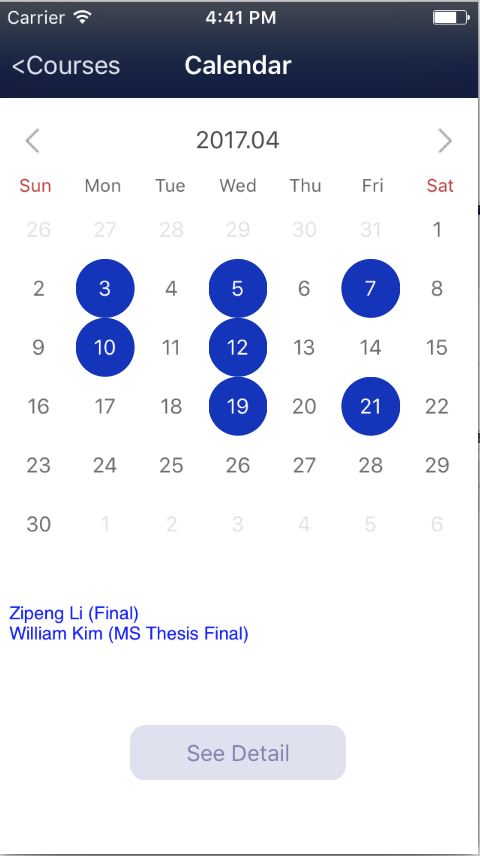
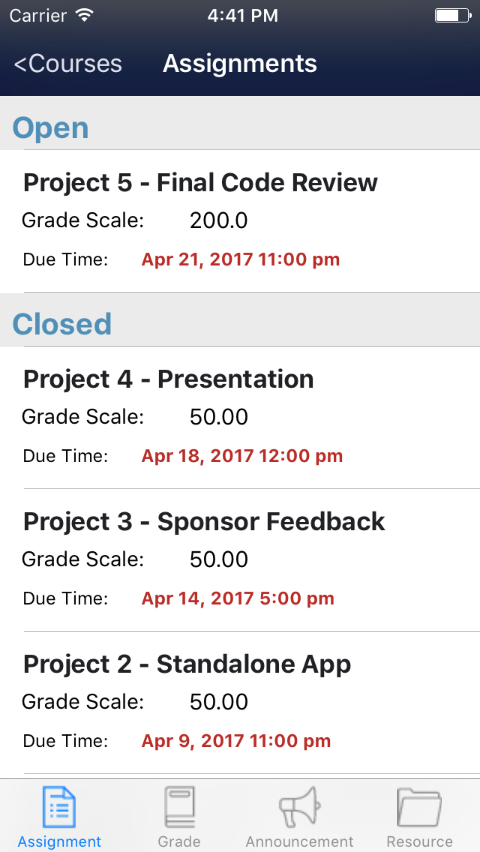

# Final Project- Bug Away- User Guide
**Group Member:** *Zhe Mao (zm34), Yuxiang Huang (yh164), Chengzhang Ma (cm391)*

## How to use Mobile Duke Sakai
Log in: 
Log in using netID and right password 
After finishing logging, press "enter" to go into app

Course Selection: 
Select Course membership

Calendar View:
Press the calendar buttom at the top right of course selection view
Select the blue-shaded date to view the title of event
Select the "See Detail" button to see the details of events

Four functions:
select a specific course to view the four functions
1. Assignment:
select each assignment item to see details
2. Grade:
select each grade item to see details
3. Announcement:
select each announcement item to see details
4. Resource:
select each file directory to see next level and then select each regular file to preview the file

